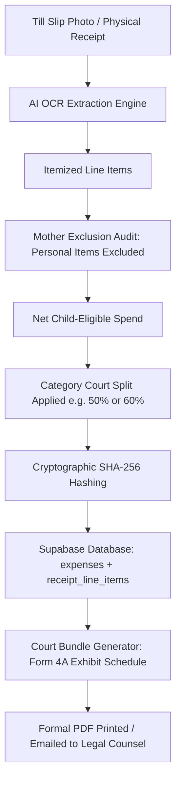

# 🏗️ Slipstats System Architecture

## 1. Overview & Architectural Principles
Slipstats is built with Next.js 15 App Router, React 19, Tailwind CSS, and Supabase. The architectural philosophy prioritizes:
1. **Emotional Clarity & Zero Cognitive Fatigue**: Calm UI states, intuitive navigation, fast feedback.
2. **Immutable Audit Integrity**: Append-only ledgers, SHA-256 receipt hashing, strict tabular number alignment.
3. **PWA Mobile-First Ergonomics**: Sub-second load times, offline resilience, and standard M3 touch targets (minimum 48x48px).
4. **Resilient Offline Fallback**: The app operates with rich local state when offline or disconnected from Supabase.

---

## 2. Directory & Component Hierarchy

```
App Shell (RootLayout)
├── AppHeader (Sticky top bar)
│   ├── Brand Identity & Page Title
│   ├── Child Filter Selector (All Kids, Liam, Maya)
│   ├── Notifications Indicator
│   └── Profile Avatar
│
├── Page Views
│   ├── /expenses & / (Dashboard)
│   │   ├── HeroBalanceCard (Shared Ledger, Tracked Total, Co-Parent Owed)
│   │   ├── ChildSpendCard (Liam & Maya Allocations)
│   │   ├── CategoryChart (Multi-segment progress visualizer)
│   │   ├── ExpenseList (Category Filter Chips + Recent Verified Slips)
│   │   └── Floating Action Button (+ Scan Till Slip)
│   │
│   ├── /scan (AI Slip Allocation)
│   │   ├── SlipContextCard (Store info, Total, OCR Score)
│   │   ├── AISmartBanner (Statutory eligibility notice)
│   │   ├── LineItemAudit (Interactive include/exclude toggles)
│   │   └── LegalCalcSummary (Dynamic child portion & co-parent share)
│   │
│   ├── /expenses/new (Manual Entry Form)
│   │   ├── Segmented Switch (Single vs Recurring)
│   │   ├── Category Carousel Chips
│   │   ├── Gross Amount & Medical Aid Gap Reconciliation
│   │   ├── Child Allocation Buttons & Co-Parent Split Ratio
│   │   └── Proof Document Attachment Box
│   │
│   ├── /reports (Court-Ready PDF Statement)
│   │   ├── Exhibit Preset Switcher (Form 4A, Rule 43, Arrears)
│   │   ├── Cryptographic SHA-256 Hash Card
│   │   ├── Action Bar (Print / Export PDF / Email to Attorney)
│   │   ├── Itemized Schedule Table (Tabular numbers)
│   │   └── Affidavit Sign-off Block
│   │
│   └── /children (Beneficiaries & Splits)
│       ├── Children Profile Cards
│       ├── Court Order Case Metadata
│       └── Category-Based Split Rules Configuration
│
└── BottomNav (M3 Persistent Mobile Navigation)
    ├── Expenses Tab
    ├── Scan Slip Tab (Highlighted pill)
    ├── Reports Tab
    └── Children Tab
```

---

## 3. Data Flow & State Management



---

## 4. Supabase Integration Strategy
* **Browser Client (`src/lib/supabase/client.ts`)**: Singleton browser client for client components. Gracefully falls back to mock data if environment variables are not set.
* **Server SSR Client (`src/lib/supabase/server.ts`)**: Cookies-based client for Next.js Server Components and Server Actions.
* **Row-Level Security (RLS)**: Enforces that all child records, receipts, and financial claims are restricted strictly to the authenticated user.
