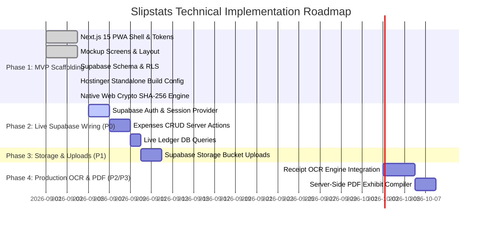

# 🧭 Slipstats: Technical Debt Audit & Engineering Roadmap

**Audit Date**: September 2026  
**Methodology**: `AnalyseTechnicalDebt` Protocol (Full-Stack Discovery, Pipeline Tracing, and Migration Roadmap)  

---

## 📊 1. At-a-Glance Route & Feature Audit

| Route | Feature Component | Type | Current Status | Backend Pipeline Status |
| :--- | :--- | :--- | :--- | :--- |
| `/` & `/expenses` | **Shared Ledger Balance** | UI Component | ⚠️ **Partial** | Reads from `mockData.ts`. Ready to bind to `expenses` table aggregate query. |
| `/` & `/expenses` | **Child Spend Allocation** | UI Component | ⚠️ **Partial** | Reads from `mockData.ts`. Ready to bind to `children` + `expenses` group by child. |
| `/` & `/expenses` | **Category Visualizer** | UI Component | ⚠️ **Partial** | Computes percentages from mock dataset. |
| `/` & `/expenses` | **Recent Expenses Feed** | UI Component | ⚠️ **Partial** | Filterable by category in client memory. |
| `/scan` | **Till Slip Header & OCR** | Interactive UI | ⚠️ **Partial** | Sample Checkers Hyper slip loaded with realistic OCR metadata. |
| `/scan` | **Interactive Line Items** | Client State | ✅ **Functional (Client)** | Real-time inclusion/exclusion state recalculation works end-to-end in React. |
| `/scan` | **Save to Court Ledger** | Action Trigger | ⚠️ **Partial** | Triggers animated success feedback; needs Supabase `INSERT` into `expenses` + `receipt_line_items`. |
| `/expenses/new` | **Single vs Recurring** | Client State | ✅ **Functional (Client)** | Tab switching and UI adaptation work smoothly. |
| `/expenses/new` | **Medical Aid Shortfall** | Calculator | ✅ **Functional (Client)** | Gross − Medical Aid = Net Shortfall math calculates in real-time. |
| `/expenses/new` | **Expense Form Submit** | Form Action | ⚠️ **Partial** | Simulates upload & hashing; needs Supabase mutation and Storage upload. |
| `/reports` | **Preset Selector** | Client State | ✅ **Functional (Client)** | Switches between Form 4A, Rule 43, and Arrears views. |
| `/reports` | **Cryptographic Hash** | UI Display | ⚠️ **Partial** | Pre-calculated SHA-256 string displayed; ready for Web Crypto API SHA-256 generation. |
| `/reports` | **Print / Export PDF** | Browser Native | ✅ **Functional** | Invokes `window.print()` with bespoke `@media print` rules for clean court document. |
| `/reports` | **Email to Attorney** | Browser Native | ✅ **Functional** | Opens `mailto:` with pre-composed formal legal notice and case parameters. |
| `/children` | **Beneficiaries Display** | UI Component | ⚠️ **Partial** | Reads from `mockData.ts`. |
| `/children` | **Split Rules Editor** | Client State | ✅ **Functional (Client)** | Updates category split percentages in state with feedback. |

---

## 🔍 2. Data Pipeline Tracing: What's Real vs Stubbed

### A. Current Architecture (Mock-Enabled Local Development)
```
[User Interaction] ➔ [React useState / UI Event] ➔ [Calculated in Memory] ➔ [Visual Feedback]
                                       │
                                       ▼ (Fallback)
                               [MOCK_EXPENSES / MOCK_DATA]
```
* **Strengths**: The entire application runs out-of-the-box with zero setup, zero broken images, and complete offline capability. A mother or legal team can preview and test every screen immediately.
* **Debt / Gap**: The data is currently held in React component state and static seed structures. Refreshing the browser resets the ledger back to seed state.

### B. Target Architecture (Live Supabase Persistence)
```
[User Interaction] ➔ [Server Actions / Supabase Client] ➔ [PostgreSQL DB + Storage]
                                                                  │
                                                                  ▼
[Real-time RLS Security] ◄── [Audit Trail / SHA-256 Hash] ◄───────┘
```

---

## ⚠️ 3. Categorized Technical Debt Inventory

### Debt Item 1: Database Persistence Layer (Priority: P0)
* **Current State**: Supabase SQL schema ([`supabase/schema.sql`](file:///c:/Users/digit/OneDrive/Desktop/GITHUB/slipstats/supabase/schema.sql)) is fully authored with RLS policies, tables, and indexes, but the UI reads from `src/lib/data/mockData.ts`.
* **Target State**: Replace local state with Supabase queries via `getSupabaseClient()` with automatic fallback to mock data when keys are absent.
* **Effort**: Medium (~3–4 hours).

### Debt Item 2: Live Receipt Photo Upload & Storage (Priority: P1)
* **Current State**: Manual entry and AI scan show static receipt previews. Native Web Crypto SHA-256 generation is now implemented and active in [`src/lib/utils.ts`](file:///c:/Users/digit/OneDrive/Desktop/GITHUB/slipstats/src/lib/utils.ts) with **$0.00 fees**.
* **Target State**: Connect file input and camera trigger to private Supabase Storage bucket (`receipts/`).
* **Effort**: Low (~1–2 hours).

### Debt Item 3: Live OCR Extraction Engine (Priority: P2)
* **Current State**: AI scan page uses an itemized Checkers Hyper slip seed structure (`MOCK_SLIP_ITEMS`).
* **Target State**: Integrate an on-device OCR engine (e.g., Tesseract.js / Client OCR) or lightweight API to extract text from raw till slip photos.
* **Effort**: Medium (~4–6 hours).

### Debt Item 4: Server-Side PDF Binary Compilation (Priority: P3)
* **Current State**: Court statements are exported via browser print (`window.print()`) with print stylesheets.
* **Target State**: Add a server route using `@react-pdf/renderer` or Puppeteer to compile and download certified PDF files with embedded receipt image attachments into `court_bundles/`.
* **Effort**: Medium (~3 hours).

---

## 🗺️ 4. Phased Engineering Roadmap



---

## 📋 5. Execution Order & Action Items

| Step | Task Description | Priority | Files Affected | Estimated Effort |
| :---: | :--- | :---: | :--- | :---: |
| **1** | **Supabase Auth Hook**: Add simple mother login/session check | **P0** | `src/lib/supabase/client.ts`, `src/app/layout.tsx` | 2 hrs |
| **2** | **Expense Mutations**: Connect `save-ledger-btn` and manual form to Supabase `expenses` table | **P0** | `src/app/scan/page.tsx`, `src/app/expenses/new/page.tsx` | 3 hrs |
| **3** | **SHA-256 Hashing Utility**: Generate live cryptographic hashes from uploaded receipt files | **P1** | `src/lib/utils.ts` | 1 hr |
| **4** | **Storage Uploads**: Upload till slip photos directly to private Supabase `receipts` bucket | **P1** | `src/lib/supabase/storage.ts` [NEW] | 2 hrs |
| **5** | **Live OCR Parsing**: Hook receipt photo uploader to Tesseract.js / Receipt OCR API | **P2** | `src/lib/ocr/parser.ts` [NEW] | 5 hrs |
| **6** | **Compiled PDF Exhibits**: Server-side binary PDF generation for attorneys | **P3** | `src/app/api/export-pdf/route.ts` [NEW] | 3 hrs |

---

## 🛡️ 6. What Is Already Solid (Do Not Touch)
1. **Design System & Typography**: Tailwind configuration faithfully embodies Material 3 Expressive, Plus Jakarta Sans, and Inter tabular numbers.
2. **PostgreSQL Schema**: Schema contains all necessary tables, RLS policies, constraints, and audit indexes.
3. **PWA Shell**: Manifest, service worker, and safe-area insets are production-ready.
4. **Hostinger Deployment Layer**: `server.js` and `output: "standalone"` are fully prepared for zero-Vercel Node.js hosting.
